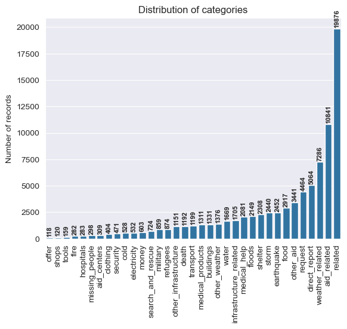
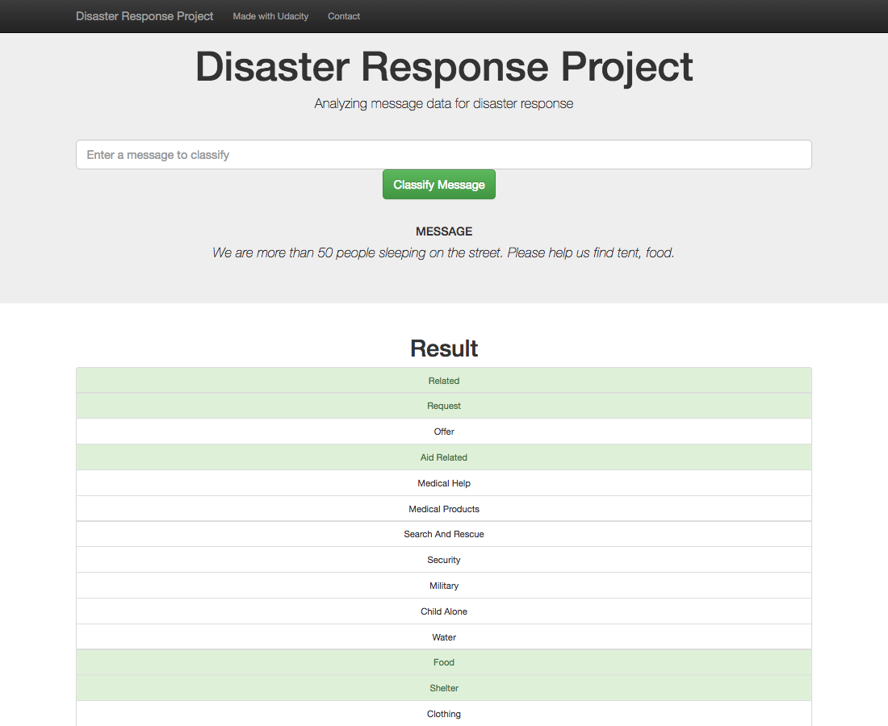

## Udacity Data Science Nanodegree

---
## Project 3: Disaster Response Pipeline Project
The purpose of this project is to demonstrate the ability to create pipelines using software and data engineering skills. 

#### Created by: Juanita Smith
#### Last date: September 2024

---
 Disaster Response Pipeline Project comparing OpenAI with CountVectorizer and TfidfTransformer
---

Are you wondering
if modern OpenAI embeddings can build better text classification models that older traditional libraries like scikit-learn's CountVectorizer and TfidfTransformer
that we learned in this Udacity course?

I would expect that OPENAI embeddings are more context-aware and understand **relationships** between words better, 
than simply doing word counts without context?
There should be a huge difference between **'I want to help'** and **'want help'**.

Let's find out !!!

<!-- TOC -->
  * [1. Project Overview](#1-project-overview)
  * [2. Udacity Project requirements](#2-udacity-project-requirements)
  * [3. Installation](#3-installation)
  * [4. Instructions ](#4-instructions-a-nameinstructionsa-)
  * [Language translator (optional step)](#language-translator-optional-step)
  * [4. File Descriptions ](#4-file-descriptions-a-namefilesa)
  * [6. Results](#6-resultsa-nameresultsa)
    * [Data cleaning](#data-cleaning)
    * [Modelling results](#modelling-results)
  * [Skills:](#skills)
  * [7. Licensing, Authors, Acknowledgements](#7-licensing-authors-acknowledgementsa-namelicensinga)
<!-- TOC -->

### Table of Contents

* [1. Project Overview](#overview)
2. [Udacity Project requirements](#requirements)
3. [Installation](#installation)
4. [Instructions](#instructions)
5. [File Descriptions](#files)
6. [Data transformation](#transform)
7. [Results](#results)
8. [Licensing, Authors, and Acknowledgements](#licensing)

  
# 1. Project Overview

This project is using data supplied from [Appen](https://www.appen.com) (formally Figure 8) that contains pre-labeled tweets and text messages that were received during real live disasters.
Using software and data engineering skills learned during this course, this project build a machine learning pipeline which build a supervised learning model to classify these events so that it can send messages to the appropriate disaster relieve agency.
Some organizations care about water, others about blocked roads, others about medical supplies.
The dataset contain 35 different categories:

The classifier needs to use **multi label** classification, meaning the same message can be classified as 'water', 'food' and 'clothing'.
As we can see in the graph, the categories are highly imbalanced.

This project includes a web app where an emergency worker can input a new message and get immediate classification results.
The webapp will use the developed classifier model to display the resulting categories for the new message.

# 2. Udacity Project requirements

1. Build an ETL pipeline to load and clean messages and store results in a SQLite database 
2. Build a machine learning pipeline that build a text processing and multi label classification model using GridSearchCV, and export the final model as a pickle file 
3. Use the trained classifier in the provided Flask Web App, to classify text messages.## 2. Installation 

## 3. Installation
To clone the repository: https://github.com/JuanitaSmith/disaster_recovery_pipelines.git

- Environment was build using Anaconda.
- Python 3.8 interpreter was used.
- Refer to `requirements.txt` for libraries and versions needed to build your environment.

- Use command `conda install -r requirements.txt` or `pip install -r requirements.txt` or `conda install -c conda-forge --yes --file requirements.txt` to rebuild the environment automatically.

- refer to `environment.yaml` for environment setup

## 4. Instructions   
1. Run the following commands in the project's root directory to set up your database and model.

    - Optional: Update the configuration file in `src/config.py` with file path location defaults if needed

    - To run ETL pipeline that cleans data and stores in database
        `python src/process_data.py data/raw/disaster_messages.csv data/raw/disaster_categories.csv data/clean/DisasterResponse.db`
        `python -m src.process_data data/raw/disaster_messages.csv data/raw/disaster_categories.csv data/clean/DisasterResponse.db`

    - Optional: To translate non-english texts to english using CHATGPT (not a project requirement)
      - To translate messages:
          `python src/translator.py ■■■■■■■■■■■■■■■■■■■■■■■■■■■■■■■■■■■■■■■■■■■imPCP8F2 True 400`
        - To only accumulate and save previous batch results:
            `python src/translator.py ■■■■■■■■■■■■■■■■■■■■■■■■■■■■■■■■■■■■■■■■■■■imPCP8F2 False 0`
            `python -m src.translator sk-proj-Niy0AyTYk1ICjnYOq2tWT3BlbkFJMmCr798Q3I5oimPCP8F2 True 400`
        - sys.argv = ['src/translator.py', 'sk-proj-Niy0AyTYk1ICjnYOq2tWT3BlbkFJMmCr798Q3I5oimPCP8F2', True, 400]
    - 
    - To run ML pipeline that trains classifier and saves
        `python -m src.train_classifier data/clean/DisasterResponse.db models/classifier.pkl`

2. Run the following command in the app's directory to run your web app.
    `python run.py`

3. Go to http://0.0.0.0:3001/

4. To run unittests 
    `python -m unittest discover`
    `python -m unittest tests.test_process_data_unittest`

## Language translator (optional step)

During EDA, it was detected that some text messages are not in English, or are only partially in English.
I used OpenAI and CHATGPT to translate a portion of these messages into pure English, to experiment with modern technologies.

Note: CHATGPT is a paid service. To run `src/translator.py`, create first an account, load some funds, and create your API key here 

Just for experimentation, only a sample of the data will be checked and converted and using batch mode as it's cheaper.
Translations will be stored in json format in `../data/translations/batch_job_results`
The `messages` table in the SQLite database in `../data/clean/DisasterResponse.db` will be updated with the improved messages.

A class was designed to convert only a portion of the messages for experimental reasons. 

Example: 
Text message for index 9874 will be translated from'
From: `2O TRI PYE, 5 POIRO, 2GD PESI, 1OMORU, 5LAY3DOLA SITWON`  
To: `20 bags of rice, 5 bottles of water, 2 packs of peas, 1 tomato, 5 layers of dollars situation` 

A log file will be created in logs/translations.log recording all processing steps
Example log file:

## 4. File Descriptions 

- 2 files were provided and stored in `../data/raw`

1. `disaster_categories.csv`:
   - id: unique key identifying each message
   - 36 categories with binary indicators 1 or 0

2. `disaster_messages.csv`:
   - id: unique key identifying each message
   - message: text message 'cleaned' by Appen although some problems still exist with translations
   - original: original text messages received
   - genre: classify text as 'news', 'social' or 'direct'

Both files contain 26248 records

## 6. Results

### Data cleaning

Preparation notebook are stored in `notebooks/ETL Pipeline Preparation.ipynb`

The following data cleaning were completed:
- category 'child_alone' was dropped as it had all entries 'False', giving us no ability to learn
- clean categories so each category appear in its own column with binary indicator 1 or 0
- merge categories and messages datasets using 'id' as key to join
- id was set as a unique index
- duplicated messages and indexes were dropped
- column 'original' was dropped as it's not needed for the model
- category `related` had 376 records that contained a non-binary value of '2', which was changed to '0' as no other categories contained true labels for such records.

### Modelling results

- XGBOOST was used
- To deal with imbalance
  - mloversampler

- metrics used and why

- cross validation approach, use both optuna and gridsearch

before over sampling and after

Precision was used as the main evaluation metrics. During a disaster there are limited resources and services, and we want to send resources where we are sure it is needed.
It's not easy to get a a high precision score, and needs engineering effort. 

auc was used, due to imbalance

## Skills:

Skills applied in this project:

Web Development using Flask, Plotly and 
Software Engineering
- Clean and modular code, see custom modules and classes
- GIT version control
- Automated unit testing using library 'unittest', see folder `tests`
- Logging - see folder `logging`for logging results
- Introduction to Object-Oriented Programming - see `src/translator.py` and `mloversampler.py` for custom classes
Data Engineering:
- Building pipelines using scikit-learn `Pipeline`

## 7. Licensing, Authors, Acknowledgements

Must give credit to Appen for the data.  
You can find the Licensing for the data and other descriptive information at the Inside Airbnb  [here](http://insideairbnb.com/get-the-data/).  
This data is licensed under a Creative Commons Attribution 4.0 International License.
