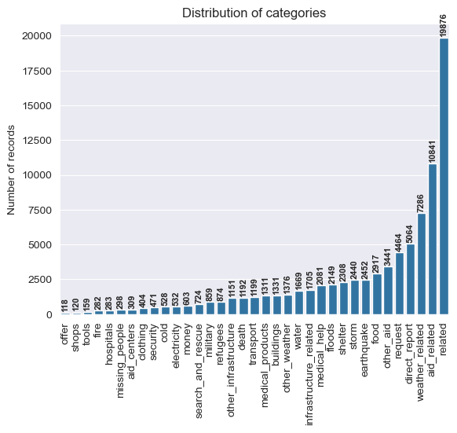
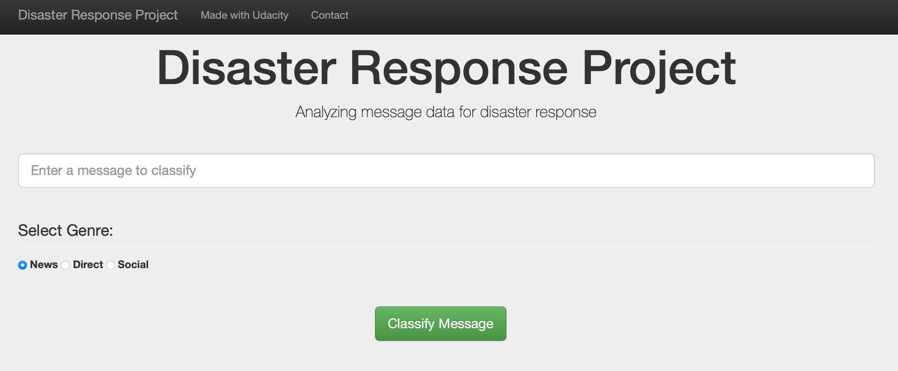
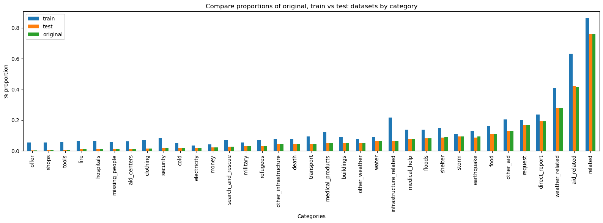
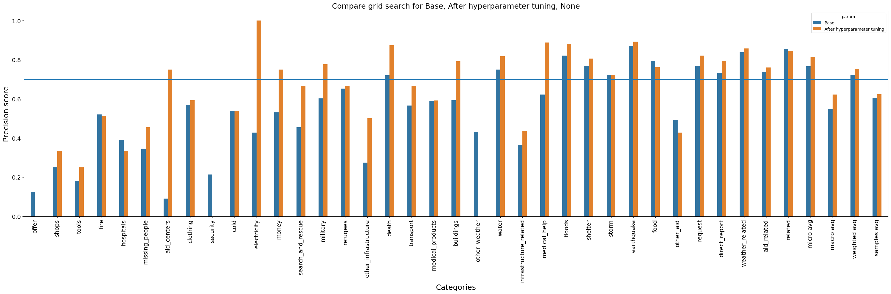
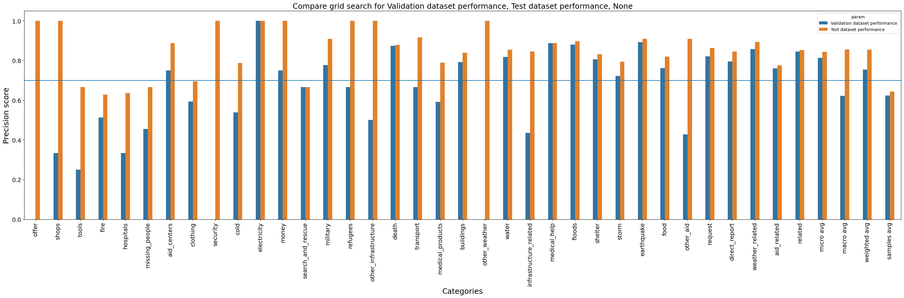
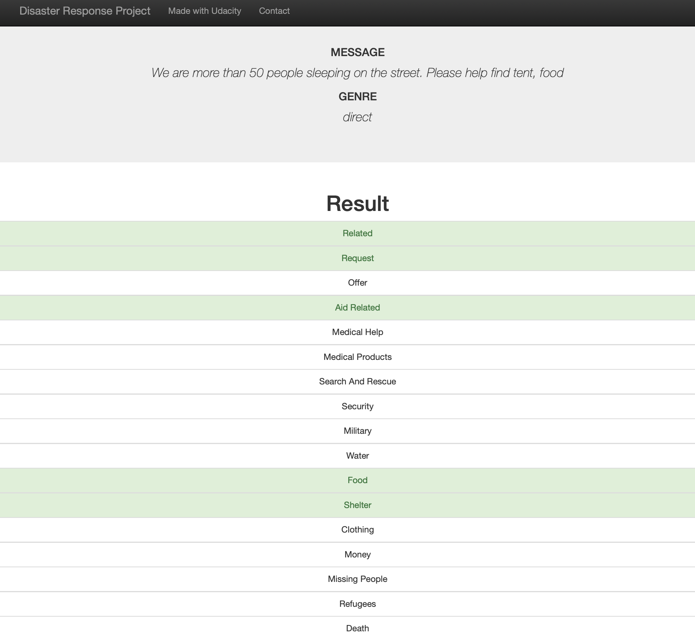
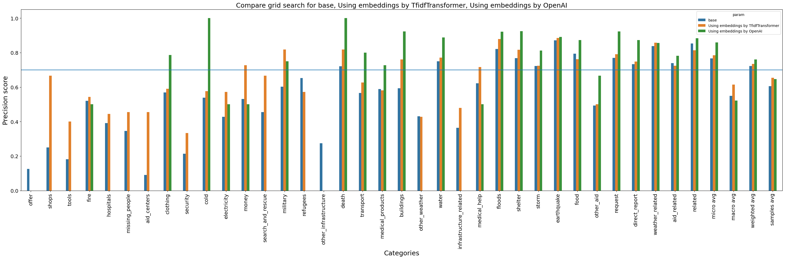

## Udacity Data Science Nanodegree

---
## Project 3: Disaster Response Pipeline Project
The purpose of this project is to demonstrate the ability to create ETL, NTL and ML pipelines using software and data engineering skills. 

#### Created by: Juanita Smith
#### Last date: September 2024

### Try out the final project web app on [here](https://disasters-JuaSmithy.pythonanywhere.com)

---
### Udacity reviewer feedback

Your hard work, dedication, and attention to detail are evident in the quality of your project submission. 
It's refreshing to see a focus on the values and benefits
it provides rather than getting lost in technical details.
Many people tend to dive straight into the technical aspects of their projects,
neglecting to highlight the real-world impact and value that the application brings.
By emphasizing the importance of your application and its practical benefits,
you showcase your ability to communicate effectively and highlight the significance of your work.
---
## Comparing OpenAI with CountVectorizer and TfidfTransformer

Are you wondering if modern OpenAI embeddings can build better text classification models 
that older libraries like scikit-learn's `CountVectorizer` and `TfidfTransformer`
that we learned in this Udacity course?

I would expect that OPENAI embeddings are more context-aware and understand **relationships** between words better, 
than simply doing word counts without context?
There should be a huge difference between **'I want to help'** and **'want help'**.

Let's find out !!!

### Table of contents

* [1. Project Overview](#1-project-overview)
* [2. Udacity Project requirements](#2-udacity-project-requirements)
* [3. Installation](#3-installation)
* [4. Instructions](#4-instructions)
* [5. Language translator with CHATGPT (optional step)](#5-language-translator-with-chatgpt-optional-step)
* [6. Input File Descriptions](#6-input-file-descriptions)
* [7. Modelling](#7-modelling)
  * [Data cleaning](#data-cleaning)
  * [Modelling approach](#modelling-approach)
    * [Dealing with Imbalance](#dealing-with-imbalance)
    * [Cross-validation](#cross-validation)
    * [Evaluation metrics](#evaluation-metrics)
    * [Model performance](#model-performance)
* [8. Flask Web App](#8-flask-web-app)
* [9. Skills learned:](#9-skills-learned)
* [10. Licensing, Authors, Acknowledgements](#10-licensing-authors-acknowledgementsa-namelicensinga)
* [11. References](#11-references)

# 1. Project Overview

This project is using data supplied from [Appen](https://www.appen.com) (formally Figure 8) that contains pre-labeled tweets and text messages that were received during real live disasters.

Using software and data engineering skills learned during this course, 
this project builds a machine learning pipeline
which builds a supervised learning model
to classify these events so that it can send messages to the appropriate disaster relieve agency.

Some organizations care about water, others about blocked roads, others about medical supplies.
The dataset contains 36 different categories:

The classifier needs to use **multi-label** classification,
meaning the same message can be classified as 'water', 'food' and 'clothing'.
As we can see in the graph, the categories are highly imbalanced. 
We don't have a lot of records with categories 'offer', 'shops', 'tools', etc. present in the dataset

This project includes a web app where an emergency worker can input a new message,
select the genre, and get immediate classification results.
The webapp will use the developed classifier model to display the resulting categories for the new message.

# 2. Udacity Project requirements

1. Build an ETL pipeline to load and clean messages and store results in an SQLite database 
2. Build a text processing and machine learning pipeline to build a classification model, and export the final model as a pickle file.
3. Use the trained classifier in the provided Flask Web App to classify text messages.

# 3. Installation
To clone the repository. use `git clone https://github.com/JuanitaSmith/disaster_recovery_pipelines.git`

- Project environment was built using Anaconda.
- Python 3.9 interpreter was used.
- Refer to `requirements.txt` for libraries and versions needed to build your environment.
- Use below commands to rebuild the environment automatically
  - `conda install -r requirements.txt` or 
  - `pip install -r requirements.txt` or 
  - `conda install -c conda-forge --yes --file requirements.txt`
- Refer to `environment.yaml` for environment setup and conda channels used
- Note: Library `iterative-stratification` was installed using pip

# 4. Instructions
Run the following commands in the project's **root directory** to set up your database and model.

A configuration file `src/config.pg` contains defaults for the project structure and file paths. 
Ideally do not change this structure.

**IMPORTANT**: MAKE SURE ALL COMMANDS ARE RUN FROM THE TERMINAL IN THE MAIN PROJECT ROOT

    1. To run the ETL pipeline that cleans data and stores results in an SQLite database:
        `python -m src.process_data data/raw/disaster_messages.csv data/raw/disaster_categories.csv data/clean/DisasterResponse.db`

        - parameter 1: path where `messages.csv` is stored
        - parameter 2: path where `disaster_categories.csv` is stored
        - parameter 3: path to SQLite database

    2. Optional Step: To translate non-english texts to english using CHATGPT (not a project requirement) 
        (See `5. Language translator with CHATGPT` below for more details)

        - To translate 400 more unchecked messages:
          `python -m src.translator <Insert OpenAI API key here> True 400`

        - To only accumulate and save previous batch results already executed on OpenAI:
          `python -m src.translator <Insert OpenAI API key here> False 0`

        - parameter 1: OpenAI API key
        - parameter 2: True or False, indicating if more messages should be checked and translated to English
        - parameter 3: If paramter 2 is True, how any messages should be checked and translated (paid service).
                       A minimum of 400 messages will be checked and translated at a time.
    
    3. To run ML pipeline that trains the classifier and saves the model: (expect 10-15 minutes runtime)

        `python -m src.train_classifier data/clean/DisasterResponse.db models/classifier.pkl`

        - parameter 1: link to SQLite database
        - parameter 2: Where model should be saved

    4. Run the following command in the **main project directory** to run your web app.

        `python disasterapp/run.py`

    5. Go to http://0.0.0.0:3001/ to run the project locally or visit the website where the project is hosted [here](https://disasters-JuaSmithy.pythonanywhere.com)

    6. Optional: To run unittests, will take around 10-15 minutes

        run command `python -m unittest discover` in the terminal

        Or to run a single unit test
        run command `python -m unittest tests.test_process_data_unittest` in the terminal

# 5. Language translator with CHATGPT (optional step)

During EDA, it was detected that some text messages are not in English, or are only partially in English.
I used OpenAI and CHATGPT to translate a portion of these messages into pure English,
to experiment with modern technologies.

Example: 
A text message for index 9874 will be translated from:
- From: `2O TRI PYE, 5 POIRO, 2GD PESI, 1OMORU, 5LAY3DOLA SITWON`  
- To: `20 bags of rice, 5 bottles of water, 2 packs of peas, 1 tomato, 5 layers of dollars situation` 

Preparation notebook is stored in `notebooks/Language Detection Pipeline Preparation`

This step can be completely omitted, it is not an Udacity project requirement, but rather some extra fun.
If this step is omitted, the original messages will be used for classification, even if they are not in English.

If the language translation step is run, (see instructions above)
then improved messages will be updated in the SQLite database without changing the original file layout.

Note: CHATGPT is a paid service. 
To run this step, create first an account and load some funds. 
(Around $5-10 is enough for a small experiment in this project)
Then create your API key here [https://platform.openai.com/account/api-keys](https://platform.openai.com/api-keys)

Just for experimentation, only a sample of the data was checked and converted and using batch mode as it's cheaper.
Translations are stored in json format in `../data/translations/batch_job_results`
The `messages` table in the SQLite database in `../data/clean/DisasterResponse.db` will be updated with the improved messages.

A class `OpenAITranslator` was designed to convert only a portion of the messages for experimental reasons. 

A log file was created in `logs/translation.log` recording all processing steps.

# 6. Input File Descriptions

- Two files were provided by Udacity and [Appen](https://www.appen.com), and stored in `../data/raw`

1. `disaster_categories.csv`:
   - id: unique key identifying each message
   - 36 categories with binary indicators 1 or 0

2. `disaster_messages.csv`:
   - id: unique key identifying each message
   - message: text message 'cleaned' by Appen although some problems still exist with translations
   - original: original text messages received
   - genre: classify text as 'news', 'social' or 'direct'

Both files contain 26,248 records

# 7. Modelling

## Data cleaning

Preparation notebook is stored in `notebooks/ETL Pipeline Preparation.ipynb`

The following data cleaning was completed:
- category 'child_alone' was dropped as it had all entries 'False', giving us no ability to learn
- clean categories so each category appear in its own column with binary indicator 1 or 0
- merge categories and messages datasets using 'id' as key to join
- id was set as a unique index, which is especially needed for language translation during OpenAI
- duplicated messages and indexes were dropped
- column 'original' was dropped as it's unnecessary for the model
- category `related` had 376 records that contained a non-binary value of '2', 
which was changed to '0' as no other categories contained true labels for such records.

## Modelling approach

Preparation notebook is stored in `notebooks/ML Pipeline Preparation.ipynb`
XGBOOST algorythm was used, as it now supports multi-label classification out of the box.

### Dealing with Imbalance
- To deal with imbalance labels, the following techniques were used:
  - Multi-label stratification split into test and train datasets, 
    using package [iterative-stratification](https://pypi.org/project/iterative-stratification/)
  - A new class `src/mloversampler.py` was developed to perform over-sampling 
    for minority classes in MULTI-LABEL classification problems by either duplicating records or using augmentation.
    The Level of duplication is determined by a ratio factor representing the severity of imbalance of each label.
    Example: label 'offer' is duplicated 20 times, whilst label security is duplicated 6 times.
  - A new custom `focal loss` function in class `src/focalloss.py` was developed
    to reduce the importance of the majority class. 
    This function is used as loss function in XGBOOST hyper parameter `eval_metric`.

Result after stratified split and oversampling: 
- Labels are evenly distributed in label datasets before and after stratified split.
- Oversampling is only applied to the training dataset, number of records increased from 17,452 to 30,815 in the notebook preparation.

### Cross-validation

During cross-validation, GridSearchCV was used for hyperparameter tuning as it was a project requirement.
Due to long runtimes, the grid search was restricted to `max_depth` and `n_estimators` only.

As a second step,
[OPTUNA](https://www.dailydoseofds.com/bayesian-optimization-for-hyperparameter-tuning/) 
was used for further hyperparameter tuning, as it's much faster.

Both Grid search and Random Search evaluate every hyperparameter configuration independently. 
Thus, they iteratively explore all hyperparameter configurations to find the most optimal one.

However, Bayesian Optimization takes informed steps based on the results of the previous hyperparameter configurations.
This lets it confidently discard non-optimal configurations. 
Consequently, the model converges to an optimal set of hyperparameters much faster.

### Evaluation metrics

**Precision macro** score was used as the main evaluation metrics. 
During a disaster, there are limited resources and services, 
and we want to send resources where we are sure it is necessary. 
Some messages are very vague and unclear.
It's not so easy to get a high precision macro score; it needs extensive engineering effort to get great results.

### Model performance

Model performance during training using **macro precision** as scoring, is increased after grid search.

Final model performance on test data is amazing with 0.84 micro precision and 0.86 macro performance !! 
Great performance on imbalanced labels.

# 8. Flask Web App

User can input a message, select the genre and click on the button 'Classify Message'.

The saved classification model will be used to classify the message.
All positive classes will be highlighted in green.

# 9. Classification with OpenAI

Using OpenAI embeddings during classification modeling is showing excellent results during training, 
with a high micro precision of 0.86, 
but poor results for imbalanced labels on the left of the graph with macro precision very low at 0.55.

Surprisingly, `CountVectorizer` and `TfidfTransformer` seems to be winner !!!???

# 9. Skills learned:

Skills applied in this project:

- Web Development using Flask, Plotly and Software Engineering
- Clean and modular code, see custom modules and classes
- GIT version control
- Automated unit testing using library `unittest`, see folder `tests`
- Logging: see folder `logging` for logging results
- Introduction to Object-Oriented Programming - see `src/translator.py` and `mloversampler.py` for custom classes
- Data Engineering: Building pipelines using `scikit-learn` `Pipeline`

# 10. Licensing, Authors, Acknowledgements

Must give credit to Appen for the data.

# 11. References

###### XGBOOST:
- [XGBOOST for LLMS](https://www.kaggle.com/code/vbmokin/llm-20-feature-xgboost-after-deobfuscation/notebook)
- [How to use XGBOOST multi-label](https://xgboost.readthedocs.io/en/latest/python/examples/multioutput_regression.html#sphx-glr-python-examples-multioutput-regression-py)
- [XGBOOST is all you need](https://www.kaggle.com/code/lucamassaron/easy-peasy-eda-xgboost-is-all-you-need/notebook)
- [Hyperparameter grid search with XGBOOST](https://www.kaggle.com/code/tilii7/hyperparameter-grid-search-with-xgboost)
- [Mastering XGBOOST Parameters Tuning](https://www.analyticsvidhya.com/blog/2016/03/complete-guide-parameter-tuning-xgboost-with-codes-python/)
- [XGBOOST Notes on Parameter Tuning](https://xgboost.readthedocs.io/en/stable/tutorials/param_tuning.html#handle-imbalanced-dataset)

###### Pipelines:
- [Nested pipelines](https://gist.github.com/amberjrivera/8c5c145516f5a2e894681e16a8095b5c)

###### Grid Search:
- [Using predefined split during cross-validation](https://stackoverflow.com/questions/31948879/using-explicit-predefined-validation-set-for-grid-search-with-sklearn)
- [Using GridSearchCV to validate against validation dataset](https://stackoverflow.com/questions/46815252/using-scikit-learn-gridsearchcv-for-cross-validation-with-predefinedsplit-susp)
- [Plotting training vs validation cross-validation scores](https://www.kaggle.com/code/willcanniford/predicting-back-pain-with-sklearn-and-gridsearchcv)
- [Early stopping](https://stackoverflow.com/questions/78178902/is-there-example-of-xgb-xgbregressor-with-callbacks-early-stop-early-stop-xgb)

###### OPTUNA:
- [Optima demo](https://github.com/optuna/optuna-examples/blob/main/xgboost/xgboost_simple.py)
- [From Daily Dose of Data Science: Bayesian Optimization for Hyperparameter Tuning](https://www.dailydoseofds.com/bayesian-optimization-for-hyperparameter-tuning/)

###### Imbalance:
- [Stratification multi-label](https://videolectures.net/ecmlpkdd2011_tsoumakas_stratification/?q=stratification%20multi%20label)
- [Test/Train split for multi-label stratification](https://datascience.stackexchange.com/questions/45174/how-to-use-sklearn-train-test-split-to-stratify-data-for-multi-label-classificat)
- [Upsample with multilabel MLSMOTE](https://www.kaggle.com/code/tolgadincer/upsampling-multilabel-data-with-mlsmote)
- [Oversampling](https://www.kaggle.com/code/thedrcat/oversampling-for-multi-label-classification)
- [Creating Balanced Multi-Label Datasets for Model Training and Evaluation](https://medium.com/gumgum-tech/creating-balanced-multi-label-datasets-for-model-training-and-evaluation-16b6a3a2d912)
- [MLSMOTE for MoA](https://www.kaggle.com/code/yassinealouini/mlsmote-for-moa)
- [Creating balanced multilabel datasets comparing multiple libraries](https://medium.com/gumgum-tech/creating-balanced-multi-label-datasets-for-model-training-and-evaluation-16b6a3a2d912)
- [XGBoost and imbalanced datasets: Strategies for handling class imbalance](https://medium.com/@rithpansanga/xgboost-and-imbalanced-datasets-strategies-for-handling-class-imbalance-cdd810b3905c)

###### Evaluation:
- [Evaluation metrics for cross valdation](https://datascience.stackexchange.com/questions/15989/micro-average-vs-macro-average-performance-in-a-multiclass-classification-settin/16001)
- [Focal loss with XGBOOST](https://www.kaggle.com/code/kriskriskris/imbalanced-data-practice)
- [Precision-recall curves](https://scikit-learn.org/stable/auto_examples/model_selection/plot_precision_recall.html)
- [Focal multi-label loss](https://www.kaggle.com/code/thedrcat/focal-multilabel-loss-in-pytorch-explained)
- [Focal loss for handling the issue of class imbalance](https://medium.com/data-science-ecom-express/focal-loss-for-handling-the-issue-of-class-imbalance-be7addebd856)

###### OpenAI:
- [Open OpenAI batch processing](https://cookbook.openai.com/examples/batch_processing)

###### Text processing
- [Text augmentation using SynonymAug](https://medium.com/@ka.kaewnoparat/the-power-of-stopword-removal-and-data-augmentation-for-imbalanced-classes-in-multi-label-61444ba8dacd)
